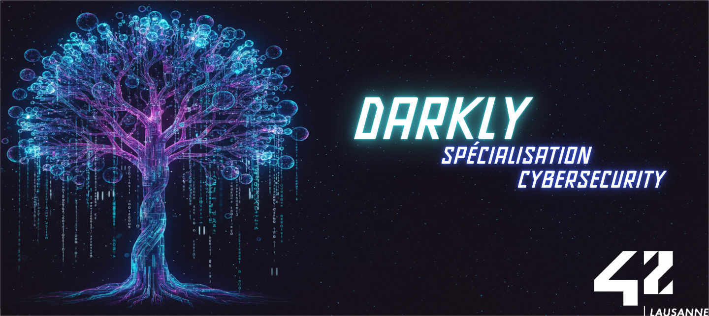

<div align="center">

# Darkly
### An Introduction to Web Security and Vulnerability Exploitation at 42 School

[![Contributors][contributors-shield]][contributors-url]
[![Forks][forks-shield]][forks-url]
[![Stargazers][stars-shield]][stars-url]
[![Issues][issues-shield]][issues-url]
[![License][license-shield]][license-url]

</div>

---

## 🇬🇧 English

<details>
<summary><b>📖 Click to expand/collapse English version</b></summary>

### 📖 About

**Darkly** is a cybersecurity project aimed at introducing students to the fundamentals of web security. The objective is to audit a vulnerable website provided within a Virtual Machine (VM) and discover a set of security flaws (flags). For each vulnerability found, we must explain how it works, how to exploit it, and how to fix it.

This project covers a wide range of common web vulnerabilities, often referenced in the **OWASP Top 10**, and requires a deep understanding of the HTTP protocol, backend logic, and browser behavior.

### 🧠 Skills Learned

By completing the **Darkly** project, we developed essential skills in offensive security and web protection:

- **Web Vulnerability Analysis**: Identifying flaws like SQL Injection (SQLi), Cross-Site Scripting (XSS), and Path Traversal.
- **Exploitation Techniques**: Manually and automatically exploiting security holes to retrieve flags.
- **HTTP Protocol**: Manipulating headers, cookies, and methods (GET/POST) to bypass controls.
- **Brute Force & Cryptography**: Cracking passwords and decoding hashes (MD5, SHA256).
- **Automation**: Writing scripts (Python/Scrapy, Bash/Curl) to automate reconnaissance and exploitation.
- **Remediation**: Understanding how to secure code against these attacks.

### 🛡️ Discovered Vulnerabilities

We successfully identified and documented **14 vulnerabilities** across the application:

1. **SQL Injection (SQLi)**
   - *Union-Based SQLi (Images)*
   - *Union-Based SQLi (Users)*
2. **Cross-Site Scripting (XSS)**
   - *Reflected XSS (Redirection)*
3. **Authentication & Session Management**
   - *Brute Force (Login)*
   - *Privilege Escalation (Cookie)*
4. **Access Control & Bypasses**
   - *Client-Side Security Bypass (Recover Password)*
   - *Client-Side Parameter Tampering (Survey)*
   - *HTTP Header Manipulation (Copyright)*
   - *Insecure Logic Handling (Feedback)*
5. **Sensitive Data Exposure**
   - *Robots.txt (Hidden Directory)*
   - *Robots.txt (Exposed Credentials)*
   - *Local File Inclusion (LFI)*
   - *Path Traversal (etc/passwd)*
6. **File Upload**
   - *Content-Type Spoofing (Upload)*

### � Installation & Usage

1. **Download the VM**: Obtain the `Darkly` ISO provided by the school subject.
2. **Virtualization**: Run the ISO in VirtualBox or VMWare.
3. **Identify IP**: Find the IP address of the VM (e.g., usually displayed on the VM login screen or via net discovery).
4. **Access**: Open your browser and navigate to `http://<VM_IP>/`.
5. **Hunt**: Start exploring the site and looking for vulnerabilities!

### 📂 Project Structure

```
42-darkly/
├── [Vulnerability Name]/       # Directory for each vulnerability
│   └── Resources/
│       ├── README.md           # Explanation, Exploitation, Remediation
│       └── whatever.whatever   # French translation dump
├── README.md                   # This file
└── ...
```

### � Credits

- **OWASP**: [Open Web Application Security Project](https://owasp.org/)
- **HackTheBox / Root-Me**: For training resources.
- **Tools**: Hydra, Dirb, Burp Suite, Scrapy (for learning, though manual exploitation is preferred).

### 📄 License

This project is licensed under the **MIT License** - see the [LICENSE](LICENSE) file for details.

</details>

---

## 🇫🇷 Français

<details>
<summary><b>📖 Cliquez pour développer/réduire la version française</b></summary>

### 📖 À propos

**Darkly** est un projet de cybersécurité visant à initier les étudiants aux fondamentaux de la sécurité web. L'objectif est d'auditer un site web vulnérable fourni dans une Machine Virtuelle (VM) et de découvrir un ensemble de failles de sécurité (flags). Pour chaque vulnérabilité trouvée, nous devons expliquer son fonctionnement, comment l'exploiter et comment la corriger.

Ce projet couvre un large éventail de vulnérabilités web courantes, souvent référencées dans le **OWASP Top 10**, et nécessite une compréhension approfondie du protocole HTTP, de la logique backend et du comportement des navigateurs.

### 🧠 Compétences acquises

En réalisant le projet **Darkly**, nous avons développé des compétences essentielles en sécurité offensive et en protection web :

- **Analyse de Vulnérabilités Web** : Identification de failles comme les Injections SQL (SQLi), le Cross-Site Scripting (XSS) et le Path Traversal.
- **Techniques d'Exploitation** : Exploitation manuelle et automatique des failles pour récupérer les flags.
- **Protocole HTTP** : Manipulation des en-têtes, des cookies et des méthodes (GET/POST) pour contourner les contrôles.
- **Brute Force & Cryptographie** : Cassage de mots de passe et décodage de hashs (MD5, SHA256).
- **Automatisation** : Écriture de scripts (Python/Scrapy, Bash/Curl) pour automatiser la reconnaissance et l'exploitation.
- **Remédiation** : Comprendre comment sécuriser le code contre ces attaques.

### 🛡️ Vulnérabilités Découvertes

Nous avons identifié et documenté avec succès **14 vulnérabilités** sur l'application :

1. **Injection SQL (SQLi)**
   - *SQLi basée sur UNION (Images)*
   - *SQLi basée sur UNION (Utilisateurs)*
2. **Cross-Site Scripting (XSS)**
   - *XSS Réfléchi (Redirection)*
3. **Authentification & Gestion de Session**
   - *Brute Force (Login)*
   - *Escalade de Privilèges (Cookie)*
4. **Contrôle d'Accès & Contournements**
   - *Contournement de Sécurité Client (Récupération de mot de passe)*
   - *Manipulation de Paramètres Client (Sondage)*
   - *Manipulation d'En-têtes HTTP (Copyright)*
   - *Gestion Logique Non Sécurisée (Feedback)*
5. **Exposition de Données Sensibles**
   - *Robots.txt (Répertoire Caché)*
   - *Robots.txt (Identifiants Exposés)*
   - *Inclusion de Fichier Local (LFI)*
   - *Traversée de Répertoire (etc/passwd)*
6. **Upload de Fichier**
   - *Usurpation de Content-Type (Upload)*

### 🚀 Installation & Utilisation

1. **Télécharger la VM** : Obtenez l'ISO `Darkly` fourni par le sujet de l'école.
2. **Virtualisation** : Lancez l'ISO dans VirtualBox ou VMWare.
3. **Identifier l'IP** : Trouvez l'adresse IP de la VM.
4. **Accès** : Ouvrez votre navigateur et allez sur `http://<IP_VM>/`.
5. **Chasse** : Commencez à explorer le site et à chercher des vulnérabilités !

### 📂 Structure du projet

```
42-darkly/
├── [Nom de la Vulnérabilité]/  # Dossier pour chaque vulnérabilité
│   └── Resources/
│       ├── README.md           # Explication, Exploitation, Remédiation
│       └── whatever.whatever   # Dump de la traduction française
├── README.md                   # Ce fichier
└── ...
```

### � Crédits

- **OWASP** : [Open Web Application Security Project](https://owasp.org/)
- **HackTheBox / Root-Me** : Pour les ressources d'entraînement.
- **Outils** : Hydra, Dirb, Burp Suite, Scrapy.

### 📄 Licence

Ce projet est sous licence **MIT** - voir le fichier [LICENSE](LICENSE) pour plus de détails.

</details>

---

[contributors-shield]: https://img.shields.io/github/contributors/HaruSnak/42-darkly.svg?style=for-the-badge
[contributors-url]: https://github.com/HaruSnak/42-darkly/graphs/contributors
[forks-shield]: https://img.shields.io/github/forks/HaruSnak/42-darkly.svg?style=for-the-badge
[forks-url]: https://github.com/HaruSnak/42-darkly/network/members
[stars-shield]: https://img.shields.io/github/stars/HaruSnak/42-darkly.svg?style=for-the-badge
[stars-url]: https://github.com/HaruSnak/42-darkly/stargazers
[issues-shield]: https://img.shields.io/github/issues/HaruSnak/42-darkly.svg?style=for-the-badge
[issues-url]: https://github.com/HaruSnak/42-darkly/issues
[license-shield]: https://img.shields.io/github/license/HaruSnak/42-darkly.svg?style=for-the-badge
[license-url]: https://github.com/HaruSnak/42-darkly/blob/master/LICENSE
